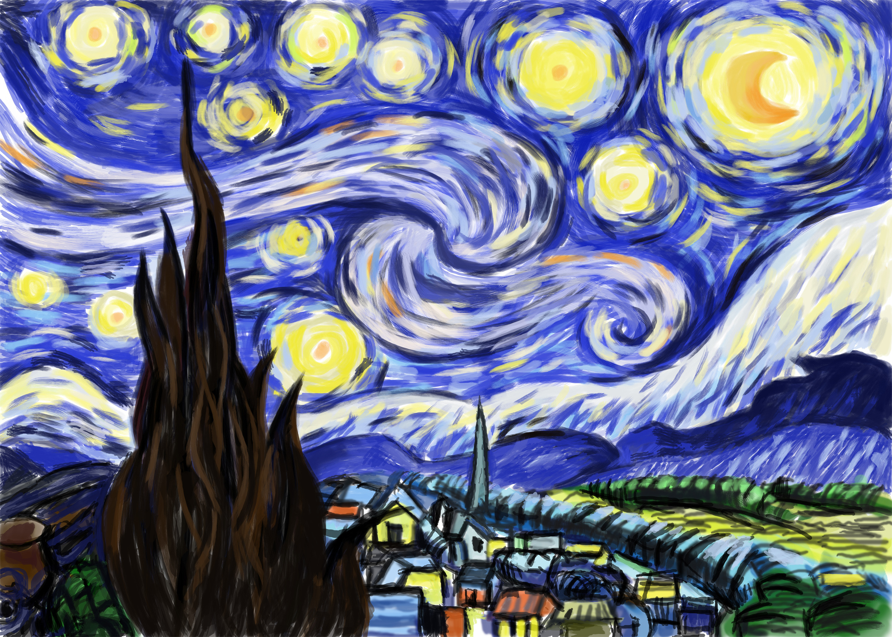
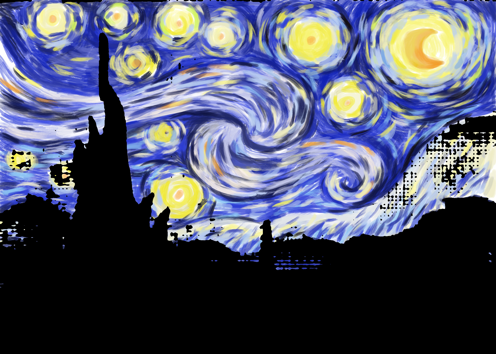
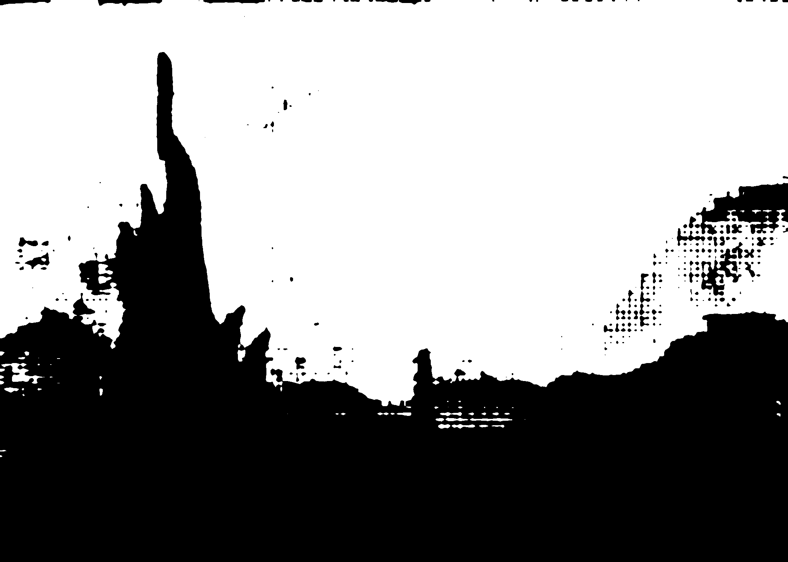
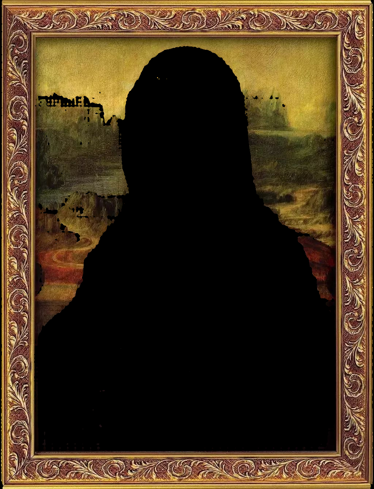
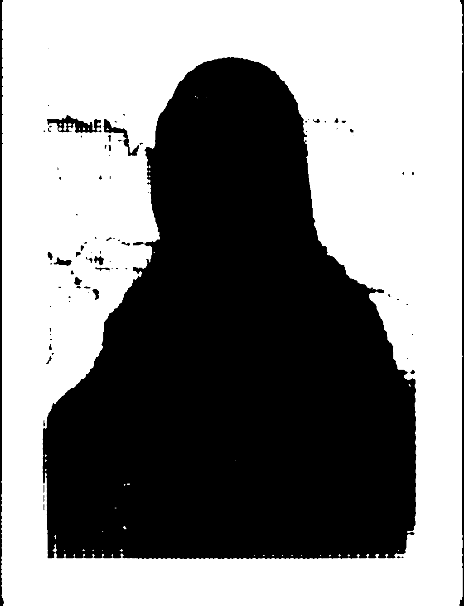
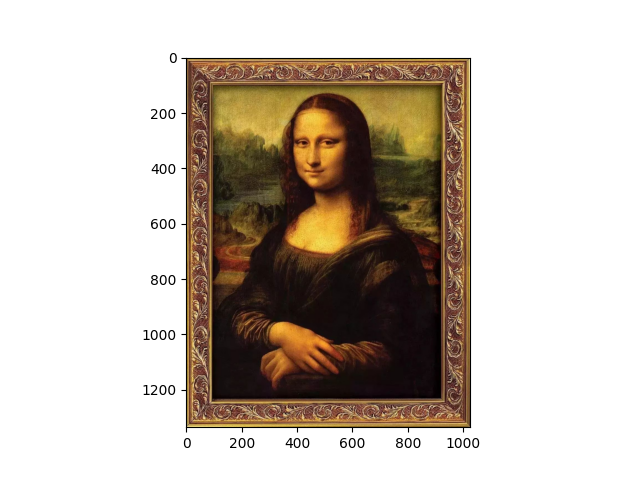
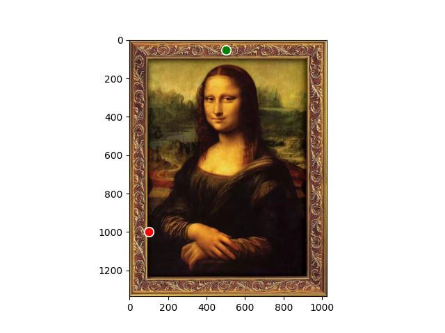
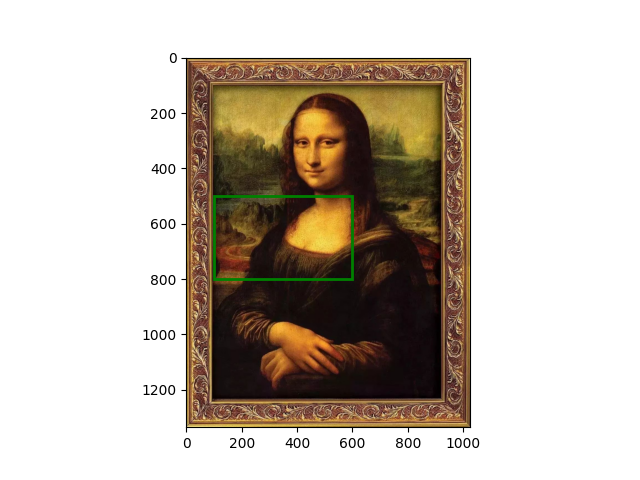

# SAM to IMG
本项目用于将[Segment-Anything](https://segment-anything.com/)模型的分割结果作为图片导出。</br></br>
This project is aimed at exporting the segmentation results of the [Segment-Anything](https://segment-anything.com/) model as images.</br></br>
本プロジェクトは、[Segment-Anything](https://segment-anything.com/)モデルのセグメンテーション結果を画像ファイルとしてエクスポートすることを目的としています。</br></br>




## 环境配置/Environment Setup/環境設定
安装依赖库/Install dependencies/依存ライブラリをインストールして：</br>
```torch==2.0.0/2.0.0+cu118```</br>
```segment-anything```</br>
```matplotlib```</br>
```dash```</br>
```dash-bootstrap-components```</br>
>不用GUI可以不安装dash。</br>
>You don't need to install dash if you don't want to use the GUI. </br>
>GUIを使用したくない場合は、dashをインストールする必要はありません。</br>

下载[SAM模型](https://github.com/facebookresearch/segment-anything)并放到```models```文件夹</br>
Download the [SAM model](https://github.com/facebookresearch/segment-anything) and put it in the ```models``` folder.</br>
[SAMモデル](https://github.com/facebookresearch/segment-anything)をダウンロードして、```models```フォルダに入れます。</br>


## 使用方法/Usage/使い方
在```app.py```里设置参数，然后运行。</br>
Set parameters in ```app.py``` and then run it.</br>
```app.py```でパラメータを設定してから実行します。</br>
>GUI版本还在开发中，目前暂不可用</br>
> The GUI version is still under development and is not currently available.</br>
> GUIバージョンはまだ開発中であり、現在利用できません。</br>

## 参数说明/Parameter Description/パラメーターの説明
```input_image```：要分割的图像</br>
```output_folder```：导出的目标文件夹</br>
```model```：使用的SAM模型（vit_h, vit_b, vit_l三种）</br>
```segmentation_method```：分割方法（点分割、框分割、自动分割）</br>
```multi_output_mask```：是否导出多个mask（自动分割时不适用）</br>
```output_layer```：导出蒙版图的内容（裁切原图、只保留分割图层、原图+分割蒙版）</br>
```img_format```：导出的图片格式（png, jpg）</br>
>带坐标的原图、选择的点和框会一并导出到输出文件夹。</br>

```input_image```: the image to be segmented</br>
```output_folder```: the target folder to export</br>
```model```: the SAM model used (vit_h, vit_b, vit_l)</br>
```segmentation_method```: segmentation method (point prompt, box prompt, auto segmentation)</br>
```multi_output_mask```: whether to export multiple masks (not applicable when auto segmentation is used)</br>
```output_layer```: the content of the exported image (cropped original image, only segmentation layer, original image + segmentation mask)</br>
```img_format```：the format of the exported image (png, jpg)</br>
>The original image with coordinates, the selected points and boxes will be exported to the output folder.</br>

```input_image```: セグメンテーションしたい画像</br>
```output_folder```: エクスポートするターゲットフォルダー</br>
```model```: 使用したいSAMモデル（vit_h、vit_b、vit_l）</br>
```segmentation_method```: セグメンテーション方法（点プロンプト、ボックスプロンプト、自動セグメンテーション）</br>
```multi_output_mask```: 複数のマスクをエクスポートするかどうか（自動セグメンテーションを使用する場合は適用されません）</br>
```output_layer```: エクスポートされる画像の内容（切り抜いた元画像、セグメンテーションレイヤーのみ、元画像+セグメンテーションマスク）</br>
```img_format```：エクスポートされる画像の形式（png、jpg）</br>
>座標付きの元画像と、選択した点とボックスと、出力フォルダにエクスポートされます。</br>

